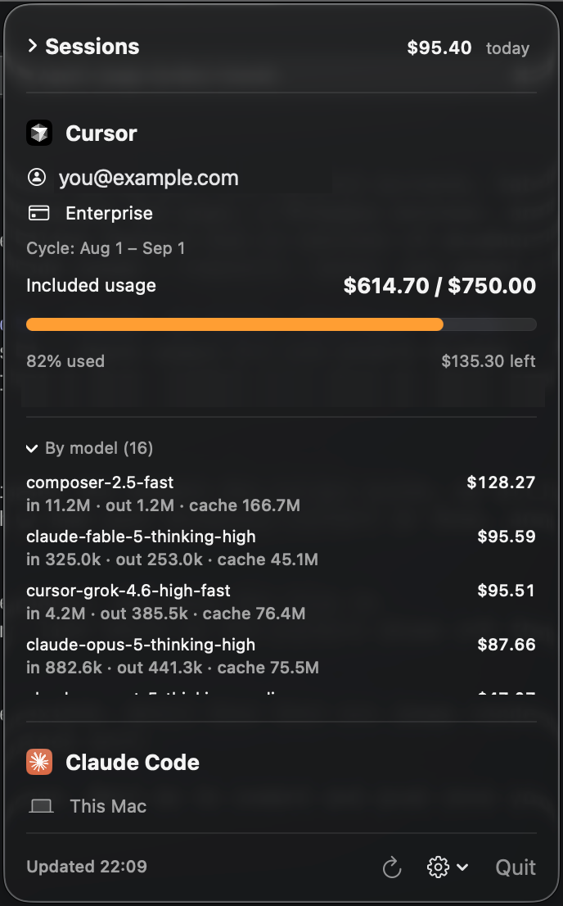

<h1 align="center">Agent Usage</h1>

<p align="center">
  <b>Your Cursor and Claude Code spend, live in the macOS menu bar.</b><br>
  Requests, dollars, per-model breakdowns, and per-session costs — without opening a dashboard.
</p>

<p align="center">
  <a href="https://github.com/itayshaked/agent-usage/releases/latest"></a>
  <a href="https://github.com/itayshaked/agent-usage/releases"></a>
  
  
</p>

<p align="center">
  
</p>

---

You burn through Cursor requests and Claude Code tokens all day, then find out
what it cost at the end of the month. **Agent Usage** puts the number in your
menu bar and keeps it there.

- 🧮 **Both tools, one panel** — Cursor and Claude Code side by side, the label cycling between them.
- ⚡ **Zero config** — reads your signed-in Cursor app and your local Claude Code logs. Nothing to paste.
- 🧵 **Per-session costs** — see what *this* conversation cost, not just the monthly total.
- 📦 **Bundles** — group the chats for one ticket and get a single price tag for the task.
- 🚦 **Limits at a glance** — the icon turns orange past 70% and red past 90% of your Cursor limit.
- 🔒 **Stays on your Mac** — no telemetry, no server, no account. Secrets live in the Keychain.

## Install

```bash
brew tap itayshaked/agent-usage https://github.com/itayshaked/agent-usage.git
brew install --cask agentusage
```

Launch **AgentUsage** from Spotlight (or `open -a AgentUsage`) and a menu bar icon
appears. Update later with `brew update && brew upgrade --cask agentusage`.

<details>
<summary>Homebrew says "untrusted tap" — or you'd rather install manually</summary>

Trust the tap once:

```bash
brew trust itayshaked/agent-usage
```

Or skip Homebrew entirely: grab the zip from the
[latest release](https://github.com/itayshaked/agent-usage/releases/latest),
unzip it, and drag **AgentUsage** into `/Applications`.
</details>

Requires macOS 13+. Menu bar only — no dock icon.

## What you get

### Cursor

Works out of the box: it reads your already signed-in Cursor app, and only ever
talks to `cursor.com`.

| | |
|---|---|
| Account | Email and plan |
| Cycle | Current billing period |
| Requests | Used / limit, with a progress bar |
| Spend | Included usage and on-demand, this cycle |
| Models | Per-model breakdown by spend or request count |

> [!NOTE]
> Cursor's usage endpoints are **unofficial** — reverse-engineered from the
> dashboard, and they may change without notice.

<details>
<summary>Auth options, if auto-detection can't find your login</summary>

Gear menu → **Cursor** → **Change token…** offers three sources:

- **Auto** *(default)* — reads the token from the signed-in Cursor app. Never expires while you stay logged in.
- **Team key** — paste a Team API key with `admin:*` scope from cursor.com/dashboard → team → API Keys.
- **Cookie** — paste a session token:
  1. Open <https://cursor.com/dashboard/usage> while logged in.
  2. DevTools (⌥⌘I) → **Application** → **Cookies** → `https://cursor.com`.
  3. Copy the value of `WorkosCursorSessionToken` (`user_01…%3A%3AeyJ…`) and paste it in.

  It's a JWT with an expiry — when it lapses you'll see an auth error, so paste a fresh one the same way.
</details>

### Claude Code

Also zero config — it reads your local session logs in `~/.claude/projects/`.
No auth, no tokens, nothing to paste. Costs are estimated from token counts
against Anthropic's published per-model pricing.

| | |
|---|---|
| Spend | Today and this month (estimated) |
| Tokens | Monthly totals, plus the input / output / cache split per model |
| Models | Per-model breakdown |

Want **org-wide billing** instead of just this Mac? Gear menu → **Claude** →
**Set Admin API key…** and paste an `sk-ant-admin…` key.

### Sessions & bundles

Every Cursor conversation and Claude Code session shows up in one list with its
own price tag, and live ones are marked as still running. Cost is *attributed*
by the provider rather than measured with a stopwatch, so overlapping sessions
add up correctly instead of each claiming the same spend.

Group related sessions into a **bundle** — the planning chat, the CI chat, the
review subagents — and the bundle carries the rolled-up total. Bundles store
only session ids and recompute from live data, so they can't drift.

## Tips

- Click the icon to expand either provider's per-model breakdown.
- Gear → **Show in menu bar**: pin the label to Cursor, to Claude, or keep it cycling.
- Gear → **Launch at login** to keep it running automatically.
- Auto-refreshes every 10 minutes; ↻ refreshes on demand.

## Privacy

No analytics, no crash reporting, no account, no backend. Cursor stats come from
`cursor.com`, Claude's Admin API (only if you opt in) from `api.anthropic.com`,
and nothing else leaves your machine. Your Cursor token and Claude Admin key are
stored in the **macOS Keychain**, never on disk in plaintext.

## Building from source

```bash
git clone https://github.com/itayshaked/agent-usage.git
cd agent-usage
./Scripts/build_app.sh
open build/AgentUsage.app
```

`Scripts/make_dist.sh` builds the release artifact and `Scripts/cut_release.sh`
publishes a version.

---

<p align="center">
  Found it useful? <a href="https://github.com/itayshaked/agent-usage">⭐ Star the repo</a> — it's how other people find it.
</p>
